# Billing — What It Is and What It Does

## The short version

Billing is the money system of record for Frappe Cloud v2. It owns everything
financial — plans and pricing, subscriptions, invoices, credits, taxes, payment
gateways, trust tiers, dunning, refunds — and it is the only part of the platform
that ever talks to a payment gateway. It is a ground-up redesign of the old
(Press) billing layer, not a patch on it.

The whole design hangs off a single split of responsibility. The regional
**Agent** is the source of truth for *what actually ran*; **Central** (this app)
owns *intent and money*. A customer can ask for a plan, but they are billed for
what the cluster actually ran. That one rule is what makes the rest of the system
make sense.

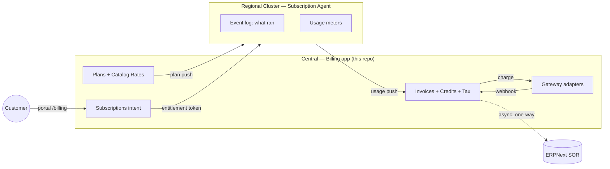

Three facts colour everything below. Billing is **pure postpaid** — every team is
billed on the 1st for the month just ended, with no charge at sign-up, not even
for a partial first month. An invoice is **computed, never stored** — it is the
Agent's record of what ran multiplied by the price Central locked in. And money
is always handled as **integer minor units** (paisa, cents) end to end, never
floats.

## The mental model

Central holds three things: the subscription, which is just the customer's
*intent* ("I asked for plan X in this region"); the price-lock, which is the rate
frozen at the moment a resource was provisioned; and the invoice, which is
computed from runtime times that locked price. The Agent holds the other two: the
event log of what physically ran, and the usage meters for how much it consumed.

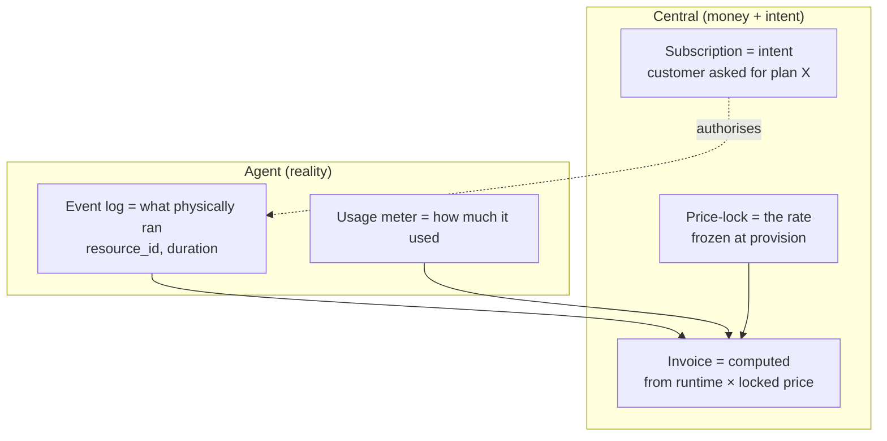

The payoff is concrete: a request that never provisioned, or a machine that was
terminated halfway through the month, bills for exactly the time it ran — not for
the intent. That kills an entire class of v1 bug where customers were charged for
things that weren't running. The same instinct runs through the other fixes too:
credits became an append-only ledger so balances can't silently go negative,
usage is aggregated at the edge so Central never drowns in raw rows, an invoice
only reaches `Paid` on a verified webhook, and ERPNext sync was made async and
one-way so a sync failure can never roll back a customer's invoice.

## How it's built

All the Python lives under `billing/`, and each sub-package is one bounded
concern: `catalog/` is what we sell (plans, pricing, subscriptions,
entitlements), `revenue/` is what we charge (invoicing, metering, credits, tax,
dunning), `payments/` is how money moves (charges, settlement, webhooks,
refunds), `gateways/` is the adapter seam where the Stripe, Razorpay and PayPal
integrations live behind one contract, and `platform/` holds the cross-cutting
infrastructure — security, Agent sync, notifications. The data model is 25
DocTypes, with a deliberate rule that anything which changes often (subscriptions,
events, payment attempts, ledger entries, price-locks) is a top-level DocType
linked by field, never a child row; child tables are reserved for write-once data
like invoice line items.

The flow across the two halves looks like this. Central pushes plan definitions
and a display price out to each cluster's local cache. A subscription request
becomes an entitlement token, signed with Ed25519, that the Agent can verify
*offline* — which is the point: provisioning is regional and Central-independent,
so a Central outage never blocks or stops a running resource. The Agent then
pushes its event log and usage rollups back, and only then does Central compute
and charge.

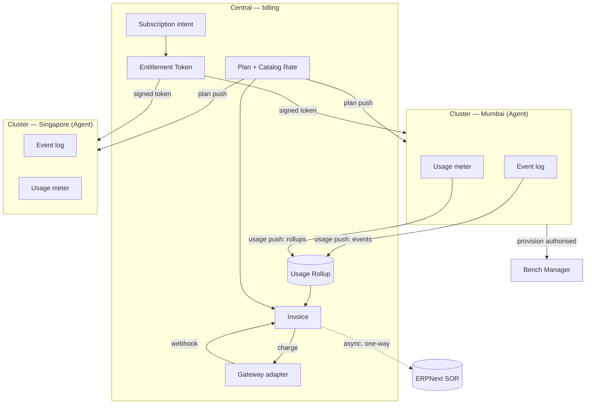

Access is divided along clean trust boundaries. A customer, on a team-scoped
session, only ever sees their own team. A platform admin sees everything. The
Agent authenticates with an API key that carries no billing role at all, so it
can reach the sync surface and nothing else — a customer or admin endpoint
returns 403. And the gateway is verified by HMAC signature as the very first
operation, before any database access, which closes the old enumeration hole.

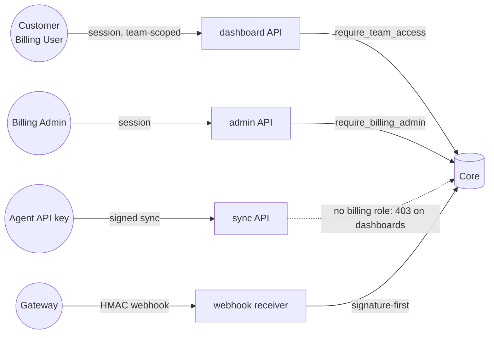

## How the pieces move

**Subscribing and the two state axes.** When a customer subscribes, Central
checks the trust-tier cap, issues a signed token, and the Agent provisions
against it offline. The Agent reports back the rate it actually showed the
customer, and Central freezes it. There are two *orthogonal* state axes that are
never collapsed into one: operational state (`running`/`stopped`/`terminated`,
owned by the Agent) and account standing (`current`/`past_due`/`suspended`, owned
by Central). A stopped machine is still alive and still bills the full bundle
rate; only `terminated` ends compute billing.

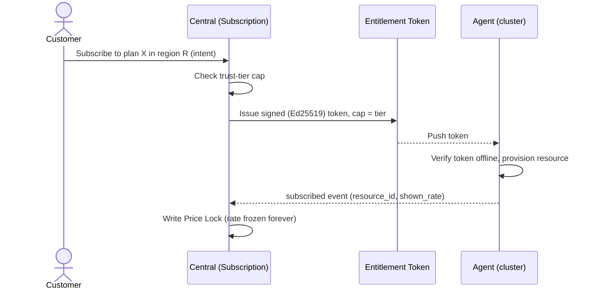

**Price-lock (grandfathering).** The rate a resource was shown at provision is
frozen against its `resource_id` and read forever. Raising a catalog rate only
affects new provisions; re-provisioning yields a new id and a new lock. The one
deliberate exception is live-priced add-ons like depreciating storage, which read
the current rate each period so a customer is never stranded on a stale-high one.

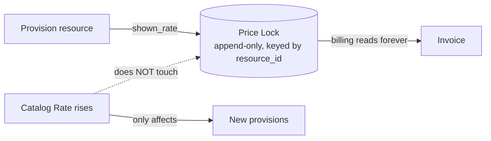

**Metering.** Usage is aggregated at the edge on the Agent and pushed up as
bounded rollups, so Central never stores ten million rows a day. A metered line
bills `max(0, quantity − allowance) × rate`, where the allowance comes from the
plan.

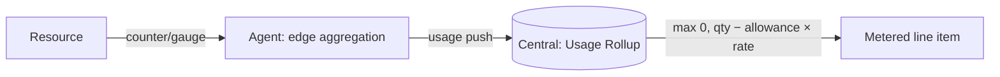

**Invoicing in two phases.** Because everything bills on the 1st, generation is
split so the 1st is never one giant blocking loop: drafts are built on the 28th
from the event log and locked prices, then finalised to Open on the 1st in
parallel. An invoice is always computed from its line items, never a stored
amount, and each region a team occupies gets one invoice per month.

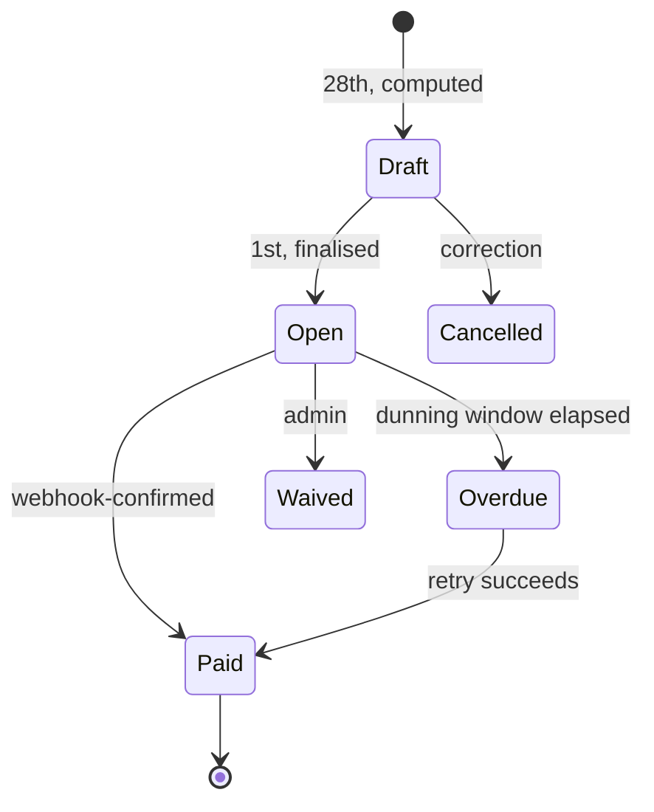

**Settlement and payment.** When an invoice opens, credits apply first and the
remainder goes to the card. The only path to `Paid` is a verified webhook, and
the receiver checks the HMAC signature before touching the database. Charges
carry an idempotency key derived from the payment attempt, and webhooks dedupe on
the gateway event id, so even a concurrent flood records exactly one capture. If
the primary card fails, collection walks the team's methods in priority order —
escalating rather than retrying the same one.

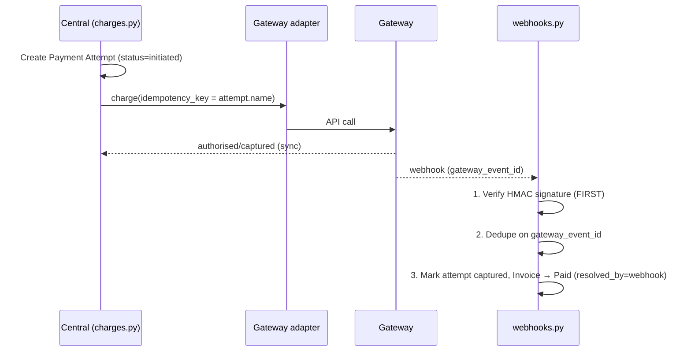

**When payment fails.** A daily job walks unpaid invoices through a staged ladder
— retries on day 1, 3 and 7, then Overdue, then a suspend directive on day 14.
The crucial detail is that suspension travels on the entitlement-token channel as
an explicit cap-0 token; Central being unreachable, or a token merely expiring,
never stops a customer's resources. A team in `past_due` keeps running until that
deliberate suspend token arrives.

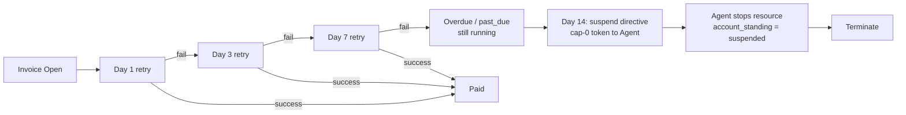

**Refunds, reconciliation, trials, ERPNext.** Refunds take one of two shapes by
intent: a full dispute goes back to the original source and the invoice stays
`Paid` (the money moved but the bill was valid), while a partial overcharge
becomes a wallet credit applied next cycle; a correction before payment is just a
cancel-and-reissue. A daily read-only reconciliation job catches charges that
succeeded at the gateway but whose webhook never arrived, marking them paid with
the provenance recorded so every `Paid` is auditable. A trial is simply the entry
trust tier, with invoices generated as `cost_report` — computed but not charged —
so you can see what a team would owe; converting flips them to billable with
resources untouched. And after any invoice is paid, Central enqueues a one-way
Sales Invoice push to ERPNext, the statutory accounting record, with
backoff retries that can never roll the customer invoice back.

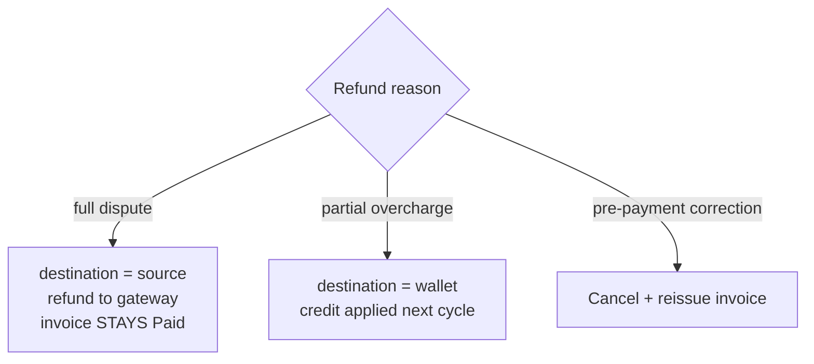

## What you can actually do with it

Everything is exposed as Frappe whitelisted methods, split by who calls them.

Customers work through the `/billing` SPA: they see a team overview (tier, cap,
standing, currency, projection), an itemised month-end forecast, their invoices
and credit ledger, and they manage payment methods — adding cards, setting a
default, ordering fallback priority. They can pay an open invoice directly or
top up wallet credits.

Admins get a console over the whole platform: revenue (MRR, on-time versus
delinquent, suspensions, payment failures, aging, trend), per-team drill-downs
and delinquency, and catalog management — including changing a plan's rate, which
writes a *new* Catalog Rate and leaves every existing price-lock untouched, so
grandfathering is automatic.

A handful of actions run from the Desk rather than the SPA, such as revalidating
and re-registering a gateway webhook or making a manual append-only credit
adjustment. Two inbound surfaces are reserved for machines: the gateway webhooks
(signature-first, dedup'd) and the Agent sync endpoints for pushing plans out and
receiving events and rollups back. And a small set of scheduled jobs keeps the
lifecycle turning — dunning, reconciliation and log cleanup daily, ERPNext
retries hourly, payment-method expiry monthly.

---

*For the full code layout and DocType breakdown see [03 — Architecture](03-architecture.md);
for the lifecycles in detail see [05 — Workflows](05-workflows.md); for the
complete endpoint list see [06 — Actions & API reference](06-actions.md).*
</content>
</invoke>
